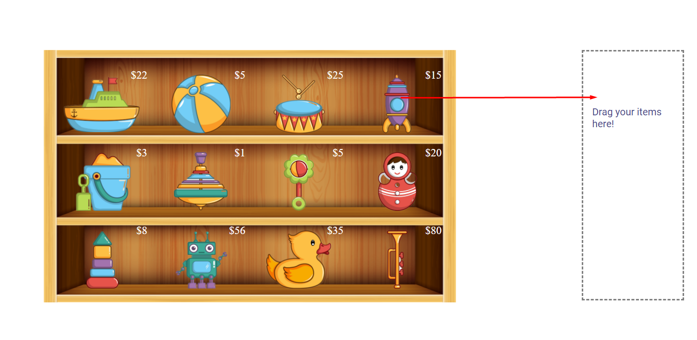
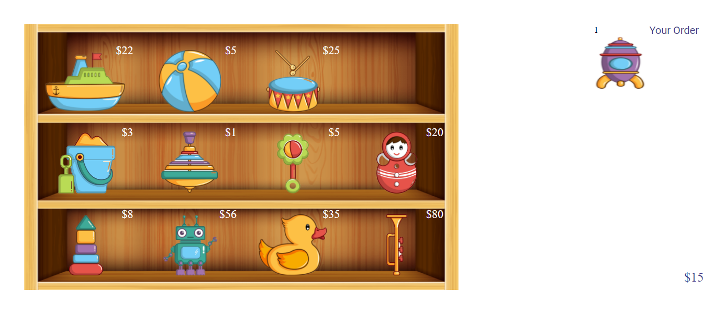
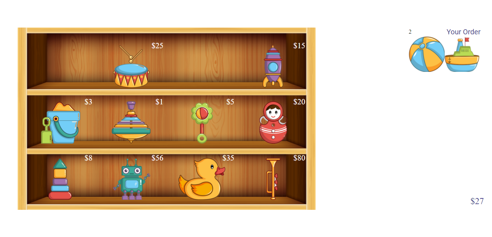

# showcase-dinamico-js (Toy Store) 
## Description

Is a project created with combined JavasCript and ES6 technologies to create a draggable toy store. It contains a very simple shoppingcart wich will calculate product quantities and prices. It only activates when some item is dragged into it.

## Usage

This app is a drag & drop solution that works with items and their prices, just drag itmes and drop them in the droppable areas to get results. You can also exchange grid items positions if there is an empty space in it.

## Contributing

Please feel free to suggest any changes through pull requests, open an issue first so we can discuss it.

## Authors

Federico Copperi
